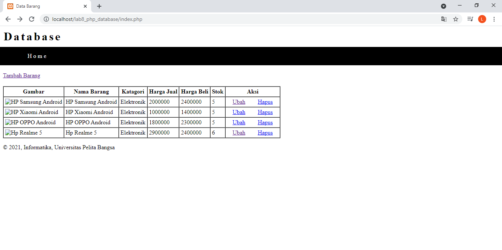

## Langkah - Langkah Pratikum

- Persiapkan text editor seperti sublime text
- persiapkan xampp

### Membuka XAMPP

### Membuat File Header
Buat file baru dengan nama header.php

output

### Membuat File Footer
buatlah file baru dengan nama footer

output

### Membuat File Home
buatlah file baru dengan nama home

Output

### Membuat File About
buatlah file baru dengan nama about

Output

## Pertanyaan dan Tugas
Implementasikan konsep modularisasi pada kode program praktikum 8 tentang
database, sehingga setiap halamannya memiliki template tampilan yang sama.

input

output

